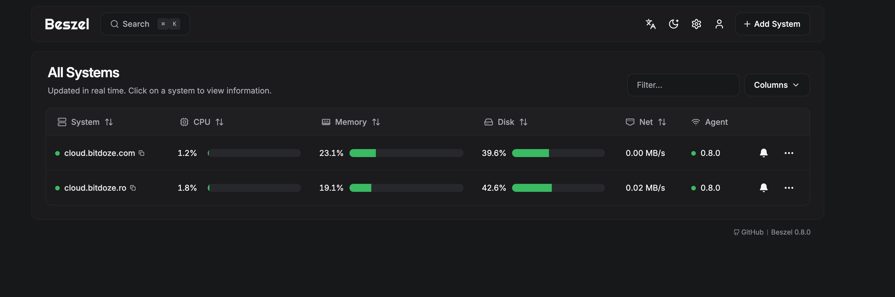
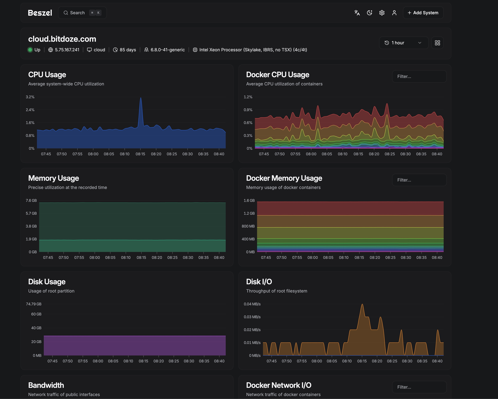
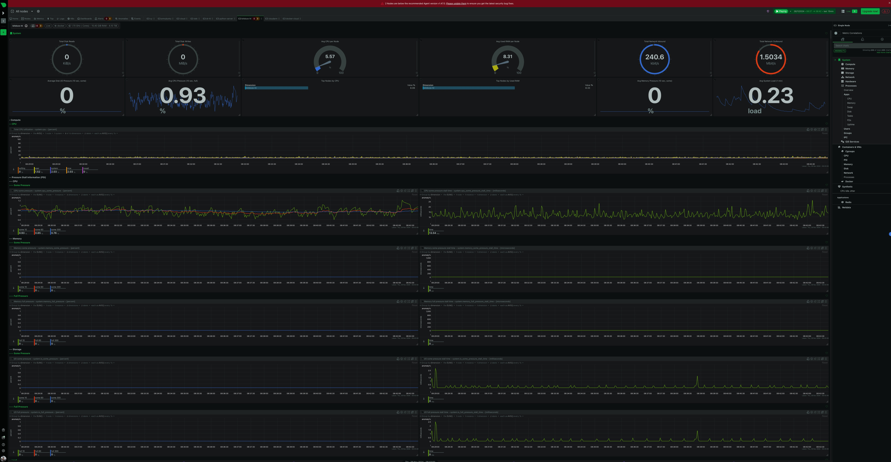
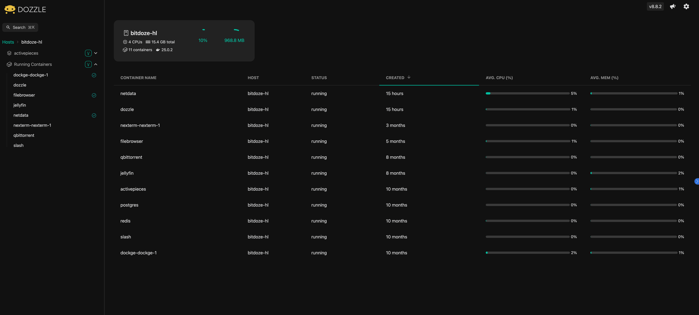
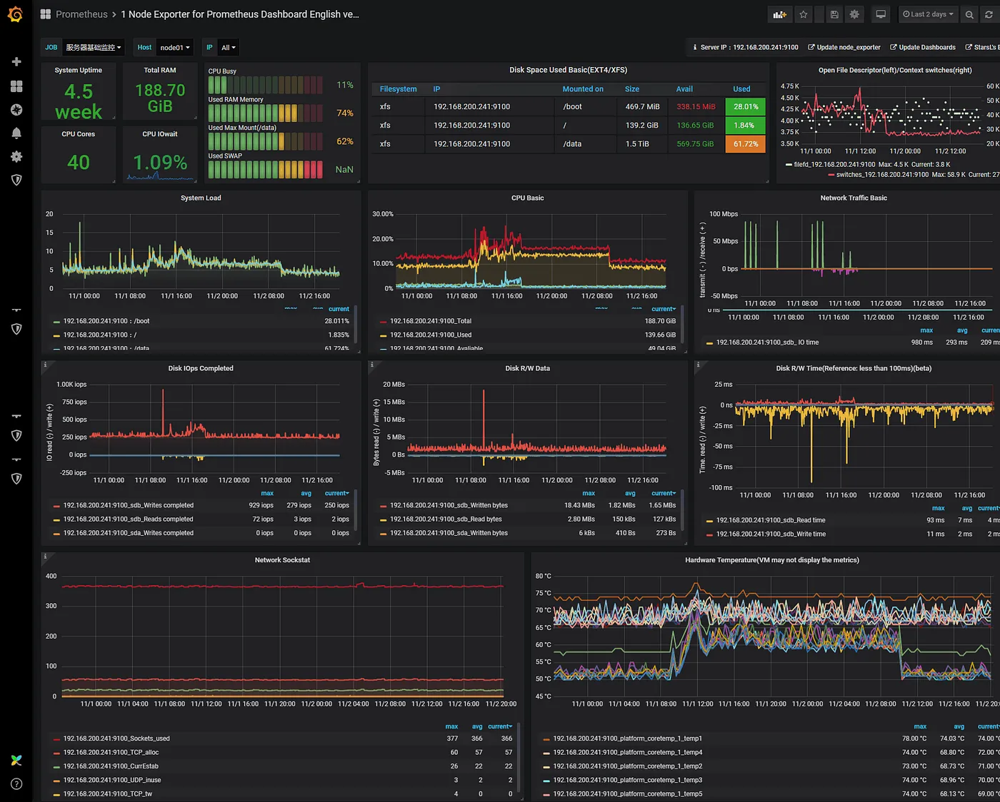

import YouTubeEmbed from "../../layouts/components/widgets/YouTubeEmbed.astro";


Server monitoring is the systematic process of observing, tracking, and analyzing server performance metrics in real-time. It's crucial for maintaining system reliability and preventing potential issues before they impact services. Modern server monitoring encompasses various aspects:

Key Components of Server Monitoring:
- Resource utilization (CPU, memory, disk, network)
- Application performance
- Service availability
- Security metrics
- Container health and performance

Server monitoring has evolved significantly with the rise of containerization and microservices architectures. Today's monitoring solutions need to handle:
- Traditional bare metal servers
- Virtual machines
- Container environments
- Cloud infrastructure
- Hybrid setups

## Key Areas in Server Monitoring

Effective server monitoring focuses on several critical areas that directly impact system performance and reliability:

1. **System Resources**
   - CPU usage and load averages
   - Memory utilization and swap usage
   - Disk I/O and storage capacity
   - Network throughput and latency

2. **Application Performance**
   - Response times
   - Error rates
   - Request queues
   - Database performance

3. **Container Metrics**
   - Container resource usage
   - Image versions
   - Container health status
   - Network connectivity

4. **Security Monitoring**
   - Failed login attempts
   - Unusual network activity
   - File system changes
   - Security updates status

Here's a comparison of monitoring priorities based on environment:

| Metric Type | Traditional Server | Container Environment | Cloud Infrastructure |
|-------------|-------------------|----------------------|---------------------|
| CPU         | Overall usage     | Per container usage  | Instance utilization|
| Memory      | Physical/Swap     | Container limits     | Instance limits     |
| Storage     | Partition usage   | Volume usage        | Block storage       |
| Network     | Interface stats   | Container networks  | VPC metrics         |

## Importance of Getting Notified in Case Something Goes Wrong

Proactive notification systems are essential for maintaining system reliability. A well-configured alerting system should:

1. **Provide Early Warning**
   - Detect potential issues before they become critical
   - Monitor trend changes that might indicate future problems
   - Alert on unusual patterns or anomalies

2. **Enable Quick Response**
   - Deliver notifications through multiple channels (email, SMS, Slack)
   - Include relevant diagnostic information
   - Provide clear action items

3. **Prevent Alert Fatigue**
   - Use intelligent thresholds
   - Implement alert correlation
   - Configure proper alert priorities


## How To Monitor Server Resources like CPU, Memory, File System Utilization or Network


> If you are interested to see some free cool open source self hosted apps you can check [toolhunt.net self hosted section](https://toolhunt.net/sh/).


<YouTubeEmbed
  url="https://www.youtube.com/embed/vG8fFm_lI-o"
  label="How To Monitor Server and Docker Resources:CPU,Memory.."
/>


Before diving into specific tools, understanding key monitoring metrics is essential:

**Essential Monitoring Metrics:**
1. **CPU Monitoring**
   - Load average (1, 5, 15 minutes)
   - Per-core utilization
   - Process CPU consumption
   - System/user time split

2. **Memory Monitoring**
   - Available RAM
   - Swap usage
   - Buffer/cache utilization
   - Per-process memory consumption

3. **File System**
   - Disk space usage
   - Inode utilization
   - Read/Write operations
   - I/O wait times

4. **Network**
   - Bandwidth utilization
   - Packet loss
   - Network latency
   - Connection states

### Beszel Monitoring Tool
---

[Beszel](https://github.com/henrygd/beszel) is a lightweight, modern monitoring solution designed for small to medium-sized deployments. It offers a clean interface and efficient resource usage while providing comprehensive monitoring capabilities.

Main Beszel Interface:


 Beszel Graphs:


#### Beszel Key Features


1. **Core Functionality:**
   - Real-time server metrics monitoring
   - Docker container statistics
   - Custom notification channels
   - Low resource footprint
   - Simple deployment process

2. **Monitoring Capabilities:**
   - System resource tracking
   - Container health monitoring
   - Network performance analysis
   - Custom metric collection

| Feature | Description | Benefit |
|---------|-------------|---------|
| Lightweight | Minimal resource usage | Ideal for small servers |
| Docker Integration | Native container monitoring | Easy container tracking |
| Public Key Auth | Secure agent communication | Enhanced security |
| Multi-server Support | Monitor multiple servers | Centralized monitoring |

#### Deploy Beszel With Docker Compose

The deployment process involves two components: the main Beszel server and agents for each monitored host.

1. **Server Setup:**
Create a `docker-compose.yml` file with the provided configuration:
```yaml
services:
  beszel:
    image: 'henrygd/beszel'
    container_name: 'beszel'
    restart: unless-stopped
    ports:
      - '8090:8090'
    volumes:
      - ./beszel_data:/beszel_data
```

2. **Agent Setup:**
On each monitored server, create another `docker-compose.yml`:


```yaml
services:
  beszel-agent:
    image: 'henrygd/beszel-agent'
    container_name: 'beszel-agent'
    restart: unless-stopped
    network_mode: host
    volumes:
      - /var/run/docker.sock:/var/run/docker.sock:ro
      # monitor other disks / partitions by mounting a folder in /extra-filesystems
      # - /mnt/disk/.beszel:/extra-filesystems/sda1:ro
    environment:
      PORT: 45876
      KEY: 'ssh-ed25519 YOUR_PUBLIC_KEY'
```

**Configuration Steps:**
1. Key Will be provided by server setup for secure communication
2. Replace `YOUR_PUBLIC_KEY` with your actual public key
3. Start the server container
4. Deploy agents on target servers
5. Configure monitoring parameters in the web interface

**Best Practices:**
- Use secure networking between server and agents
- Implement proper backup for Beszel data
- Regular updates of both server and agent containers
- Monitor agent connectivity

[Beszel Documentation](https://github.com/henrygd/beszel)


### Netdata Server Monitoring
---

[Netdata](https://www.netdata.cloud/) stands out as a powerful, real-time performance and health monitoring solution that provides exceptional granularity and minimal system overhead. You can use the cloud option to monitor up to 5 nodes for free.



#### Netdata Key Features

1. **Real-time Monitoring:**
   - Per-second metric collection
   - Zero configuration auto-detection
   - Thousands of metrics out of the box
   - ML-powered anomaly detection

2. **System Coverage:**
   - Detailed system metrics
   - Application monitoring
   - Custom metrics integration
   - Network stack analysis

**Feature Comparison Table:**

| Feature | Community Edition | Cloud Edition |
|---------|------------------|---------------|
| Real-time Monitoring | ✓ | ✓ |
| Historical Data | 1-day retention | Unlimited |
| Alert Notifications | Basic | Advanced |
| ML Capabilities | Limited | Full |
| Team Collaboration | - | ✓ |
| Custom Dashboards | Basic | Advanced |

#### Netdata Deploy

You can deploy netdata on your own server or you can use their cloud option to monitor 5 nodes for free. I am using the cloud version and you can add a node easy by docker compose or by installing netdata agent. Netdata is a robust application meant to capture a lot of metrics. Alters can be defined in configuration files.


### Dozzle Docker Monitoring
---

[Dozzle](https://dozzle.dev/) is a lightweight, web-based log viewer for Docker containers that requires minimal setup and provides real-time log monitoring capabilities.



#### Dozzle Key Features

1. **Core Capabilities:**
   - Real-time log streaming
   - No database required
   - Filter and search functionality
   - Multi-container support

2. **User Experience:**
   - Clean, modern interface
   - Easy container navigation
   - Download logs capability
   - Mobile-responsive design

**Implementation Best Practices:**

| Aspect | Recommendation | Reason |
|--------|---------------|---------|
| Access Control | Use reverse proxy | Security |
| Log Retention | Configure Docker log rotation | Prevent disk filling |
| Network | Internal network only | Security |
| Updates | Auto-update enabled | Latest features |

#### Dozzle Docker Compose Deploy


```yaml
services:
  dozzle:
    container_name: dozzle
    image: amir20/dozzle:latest
    volumes:
      - /var/run/docker.sock:/var/run/docker.sock
    ports:
      - 5003:8080
    restart: unless-stopped
```
**Security Considerations:**
1. Limit access to trusted networks
2. Implement authentication
3. Use HTTPS
4. Regular security audits


### Prometheus and Grafana
---

This powerful combination provides enterprise-grade monitoring capabilities, with Prometheus handling metrics collection and storage while Grafana delivers sophisticated visualization and alerting.



#### Prometheus and Grafana Key Features

**Prometheus Capabilities:**
1. **Data Collection:**
   - Pull-based metrics collection
   - Service discovery integration
   - Custom metrics support
   - Powerful PromQL query language

2. **Storage:**
   - Time-series database
   - Efficient data compression
   - Customizable retention periods
   - High-performance storage engine

**Grafana Strengths:**
1. **Visualization:**
   - Customizable dashboards
   - Multiple data source support
   - Rich graph types
   - Template variables

2. **Alerting:**
   - Multi-channel notifications
   - Alert grouping
   - Custom alert rules
   - Escalation policies

**Comparison with Other Solutions:**

| Feature | Prometheus/Grafana | Netdata | Beszel |
|---------|-------------------|----------|---------|
| Scalability | Enterprise-grade | Medium | Small-Medium |
| Setup Complexity | High | Low | Low |
| Customization | Extensive | Moderate | Basic |
| Resource Usage | Moderate-High | Low | Very Low |
| Learning Curve | Steep | Moderate | Gentle |

#### Prometheus and Grafana Deployment Overview

Prometheus and Grafana can be deployed through several methods, each suited for different environments and requirements. The most straightforward approach is using Docker Compose, which provides a containerized solution ideal for most deployments. Alternatively, you can use Kubernetes with Helm charts for enterprise-scale deployments, or traditional binary installations for bare-metal setups.

For Docker-based deployments, the essential components include Prometheus for metrics collection, Grafana for visualization, and various exporters like Node Exporter for system metrics and cAdvisor for container statistics. The setup typically involves creating a Docker Compose file that defines these services and their interconnections. Prometheus is configured through a `prometheus.yml` file, where you specify scrape targets and intervals, while Grafana is configured via environment variables or configuration files.

For production environments, consider these deployment options:
- Docker Compose: Ideal for single-host deployments
- Kubernetes: Best for scalable, distributed environments
- Ansible automation: For consistent multi-host deployments
- Cloud-managed solutions: AWS Managed Grafana or Google Cloud Managed Prometheus

Key configuration considerations include:
- Data persistence through volume mounts
- Security configurations including authentication
- Network access controls
- Backup strategies
- High availability setup for critical environments

For detailed implementation steps, refer to the official documentation: [Prometheus Installation](https://prometheus.io/docs/prometheus/latest/installation/) and [Grafana Installation](https://grafana.com/docs/grafana/latest/setup-grafana/installation/). Both tools offer extensive customization options and can be tailored to specific monitoring requirements.


## Conclusions

Choosing the right monitoring solution depends on several factors:

1. **Scale Requirements:**
   - Small deployments: Beszel or Netdata
   - Medium deployments: Netdata
   - Large deployments: Prometheus/Grafana

2. **Resource Considerations:**
   - Limited resources: Beszel
   - Moderate resources: Netdata
   - Substantial resources: Prometheus/Grafana

3. **Expertise Level:**
   - Beginners: Dozzle for logs, Netdata for metrics
   - Intermediate: Beszel, Netdata with custom configs
   - Advanced: Prometheus/Grafana stack

**Best Practices Summary:**
- Start with basic monitoring and expand as needed
- Implement proper alerting with meaningful thresholds
- Regular backup of monitoring data
- Keep monitoring tools updated
- Document monitoring setup and procedures
