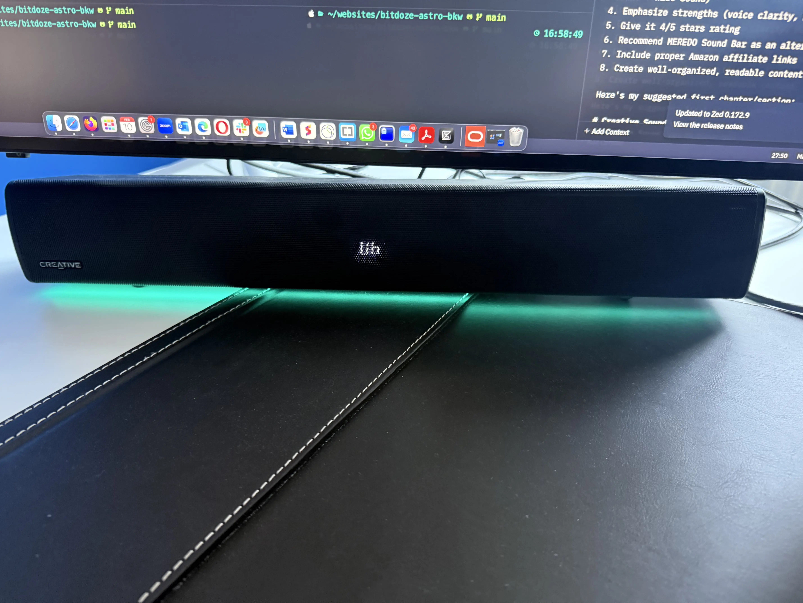
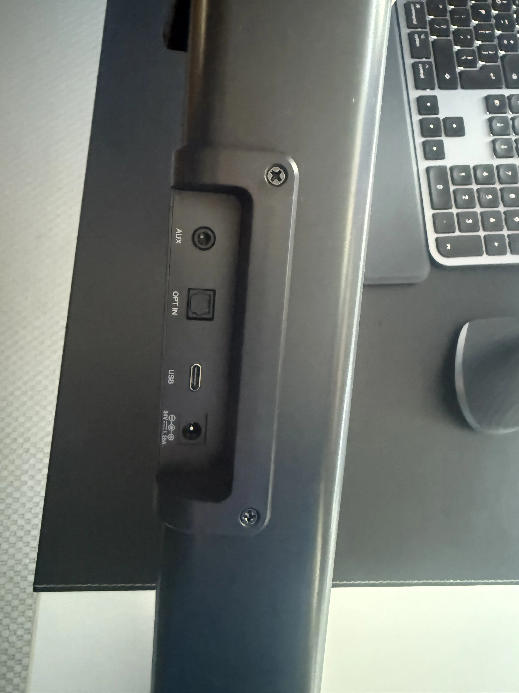
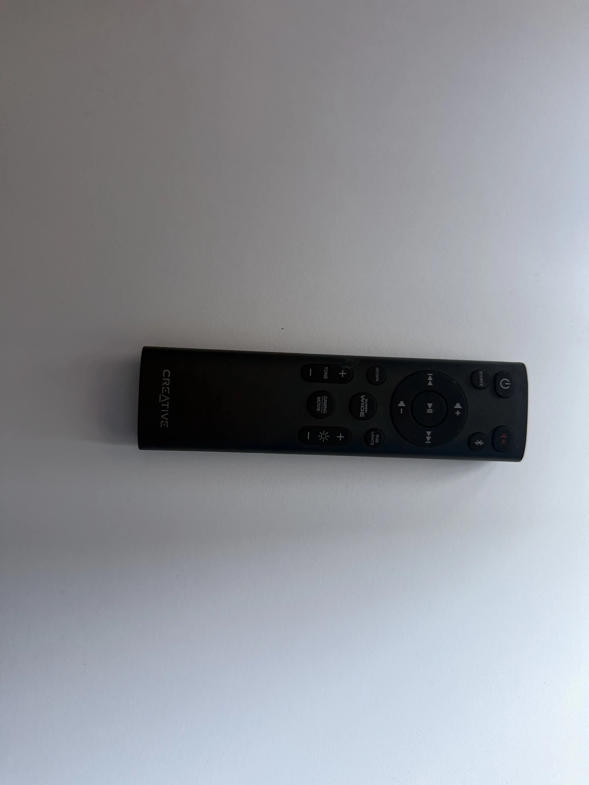
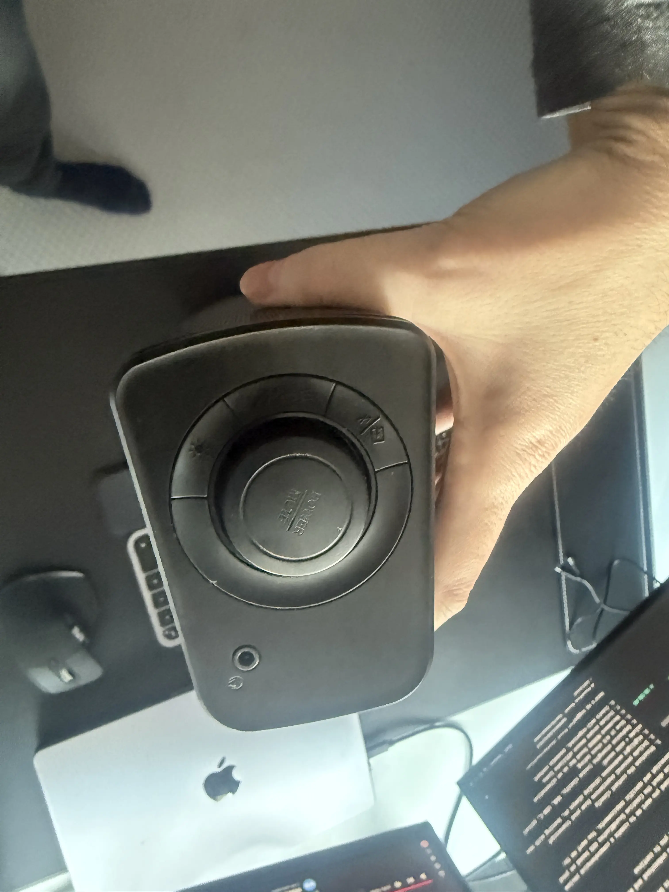

import YouTubeEmbed from "../../layouts/components/widgets/YouTubeEmbed.astro";

**Rating: ⭐⭐⭐⭐ (4/5)**

The [Creative SoundBlaster GS5](https://amzn.to/418lEIk) is a compact desktop soundbar that aims to enhance your computer audio experience without breaking the bank. After using it for several weeks, I can confidently say it offers good value for its ~$70 price point, though it's not without some minor issues worth considering.

[Check Latest Price on Amazon](https://amzn.to/418lEIk)

## Sound Blaster GS5 Video

<YouTubeEmbed
  url="https://www.youtube.com/embed/NGgY3lcZdfgk"
  label="Creative Sound Blaster GS5 Review"
/>

## Design & Build Quality

The GS5 features a sleek, modern design that fits perfectly under most monitors. At approximately 20 inches (50cm) in length, it's ideally sized for desktop setups, particularly working well with monitors 32 inches and larger. The all-black aesthetic is professional, while the honeycomb grille adds a touch of sophistication.

### Physical Features:
- Length: ~20 inches (50cm)
- Power Output: 2 x 15W speakers (30W RMS, 60W Peak)
- Display: LED screen showing current settings
- RGB Lighting: Customizable with multiple effects
- Controls: Physical buttons on unit + remote control

### Connectivity Options:
- USB-C port for PC/Mac connection
- Optical input
- 3.5mm auxiliary input
- Bluetooth 5.3
- Headphone jack

### Remote Control
The included remote control adds considerable convenience, offering easy access to:
- Volume adjustment
- Input source selection
- Sound mode switching (Gaming/Movie modes)
- RGB lighting controls
- Tone adjustments
- SuperWide mode settings

### Notable Design Drawbacks
The most significant design issue is the always-on LED display that cannot be turned off. While useful for showing current settings, it might be distracting in darker environments or when trying to maintain a clean aesthetic.

## Sound Quality & Performance

### Overall Sound Profile
The Creative SoundBlaster GS5 delivers impressive audio quality for its price point, particularly excelling in voice clarity. The dual 15W speakers provide a balanced sound signature that works well for both multimedia content and music playback.

### Sound Modes
- **Normal Mode**: Well-balanced for general use
- **Gaming Mode**: Enhanced spatial awareness and effects
- **Movie Mode**: Improved dialogue clarity and ambient sounds
- **SuperWide Mode**: Expands soundstage (with some limitations)

### SuperWide Feature - The Good and Bad
While the SuperWide feature can create an impressive soundstage expansion, there's a notable drawback: when used at maximum volume, it produces an unwanted buzzing sound. This is one of the main reasons for the 4-star rating instead of 5.

### Volume and Clarity
- Maximum volume level: 32 steps
- Clear, distortion-free sound at normal listening levels
- Particularly good for YouTube content and voice-heavy media
- Performs well for desktop gaming and movie watching
- Decent bass response without a separate subwoofer

### Real-World Performance
In daily use, the GS5 significantly outperforms built-in monitor or laptop speakers. As noted in testing, it provides a substantial upgrade over default Mac Pro speakers, especially for YouTube content and music playback at moderate volumes.

## Features & Functionality

### RGB Lighting System
The GS5 comes with an impressive RGB lighting system that adds ambiance to your setup:
- Multiple lighting effects and patterns
- Customizable colors and intensities
- Various modes including:
  - Chasers
  - Aurora
  - Peak Meter
  - Glow
  - Wave
  - Cycle

### Smart Audio Controls
- **Tone Adjustment**: Fine-tune audio to your preference
- **Volume Control**: Both on unit and remote
- **Source Switching**: Easy toggling between inputs
- **SuperWide Technology**: Near-field and far-field options

### Connectivity Features
- **Bluetooth 5.3**: For wireless device connection
- **USB-C**: Direct PC/Mac connection with digital audio
- **Optical Input**: For gaming consoles and TVs
- **Auxiliary Input**: For analog audio sources
- **Headphone Output**: Convenient front-panel access

### Creative App Integration
The soundbar can be controlled through Creative's software, offering:
- Custom EQ settings
- RGB customization
- Audio preset management
- Firmware updates

### Power and Performance
- 30W RMS total power (2 x 15W)
- 60W peak power capability
- Efficient power management system
- USB-powered option for convenience

## Price & Value Proposition

### Price Point Analysis
At approximately $70 ([Check Current Price](https://amzn.to/418lEIk)), the Creative SoundBlaster GS5 positions itself in the mid-range desktop soundbar segment, offering:
- Good value for feature set
- Competitive pricing against similar products
- Quality build for the price point

### What You Get for the Money
- Quality desktop soundbar
- Full-featured remote control
- RGB lighting system
- Multiple connectivity options
- Creative software support

### Value Comparison
**Pros Justifying the Price:**
- Clear, balanced sound
- RGB lighting features
- Multiple input options
- USB-C connectivity
- Remote control included
- Solid build quality

**Cons to Consider:**
- Always-on display
- Buzzing at max volume with SuperWide
- No separate subwoofer

### Better Alternative to Consider
For those seeking a more complete sound system, the [MEREDO Sound Bar](https://amzn.to/4hSlFFR) offers:
- 3.1 channel system with subwoofer
- Enhanced bass response
- Similar RGB features
- Comparable connectivity options
- Better suited for larger spaces

## Final Verdict

### Overall Rating: ⭐⭐⭐⭐ (4/5)

### Who Should Buy the GS5?
- Desktop PC/Mac users seeking audio upgrade
- Those wanting a compact soundbar solution
- Users valuing RGB aesthetics
- Budget-conscious buyers needing multiple connectivity options
- Those prioritizing voice clarity in content

### Who Should Skip It?
- Users needing maximum volume without distortion
- Those wanting a display-free design
- Audiophiles seeking premium sound
- Users requiring deep bass (might want to consider the MEREDO alternative)

### Final Thoughts
The [Creative SoundBlaster GS](https://amzn.to/418lEIk) delivers solid performance for its price point. While not perfect, its combination of features, sound quality, and connectivity options make it a worthwhile investment for desktop audio enhancement. The two main drawbacks (always-on display and SuperWide mode buzzing at max volume) are notable but not deal-breakers for most users.

### Recommendation
If you're primarily using it for desktop computing, YouTube content, and moderate volume music playback, the GS5 is a solid choice at its price point. However, if you need more powerful audio or better bass response, consider stepping up to the [MEREDO Sound Bar](https://amzn.to/4hSlFFR) with its included subwoofer.

[Check GS5 Price on Amazon](https://amzn.to/418lEIk)
