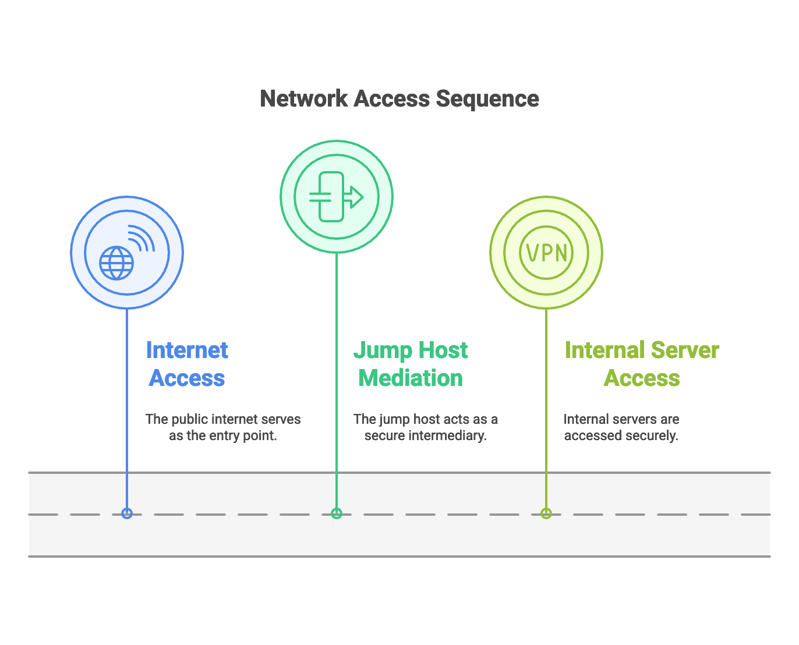
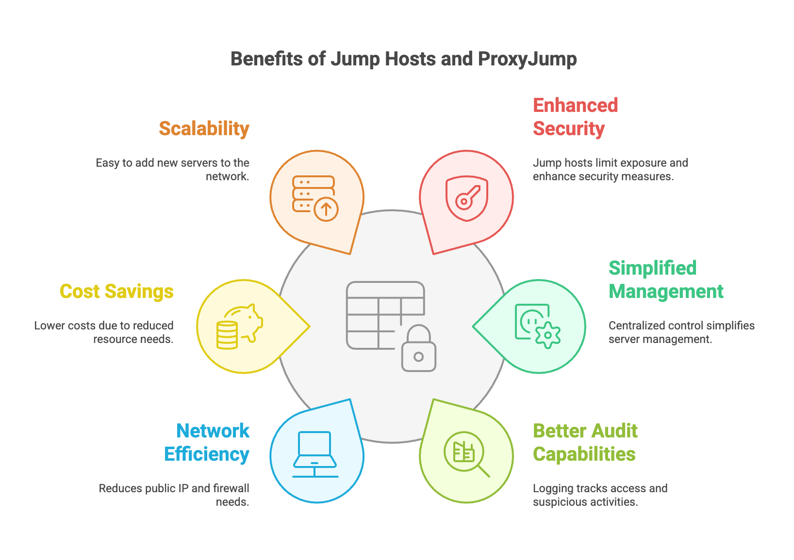
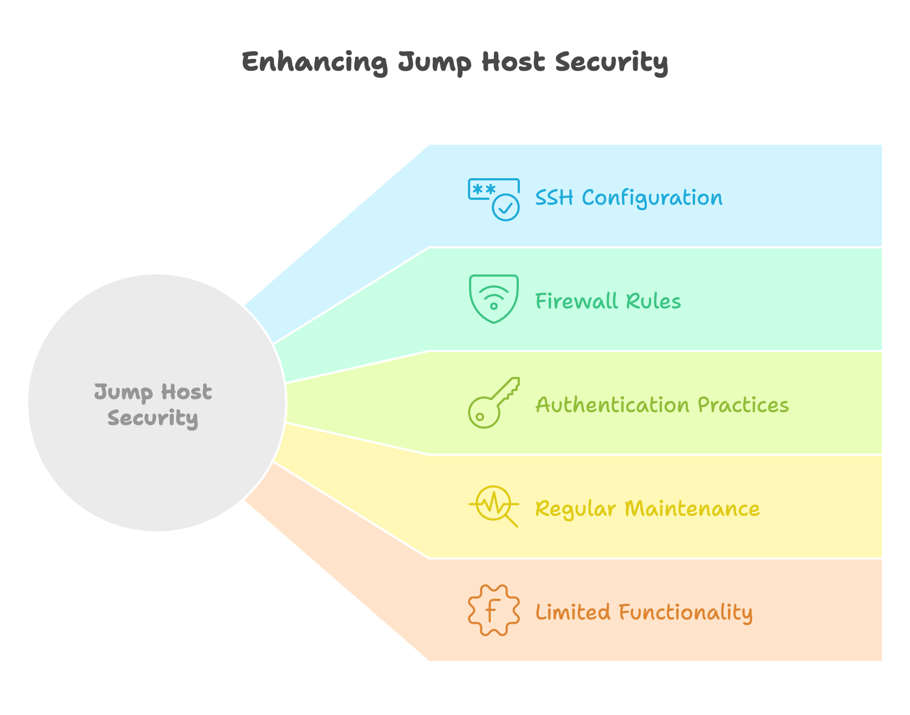

You know that moment when you need to access a server that's tucked away in a private network, and you feel like you need to jump through hoops to get there? That's exactly the problem I faced when managing multiple servers across different networks.

While working on various projects, I learned that directly exposing servers to the internet is a security nightmare. That's where I discovered SSH Jump Hosts (also called Bastion Hosts) and the ProxyJump feature - they're game-changers for accessing remote servers securely.

Think of it this way: instead of leaving all your servers exposed to the internet (which is like leaving all your doors unlocked), you create one secure entry point through which all traffic flows. Before I started using jump hosts, I was relying solely on [basic SSH security measures](https://www.bitdoze.com/secure-ssh-server-linux/), which while important, weren't enough for complex network setups.

In this guide, I'll walk you through:
- Understanding SSH jump hosts
- Setting up ProxyJump (the modern, simpler way to use jump hosts)
- Practical examples that you can use right away
- Security considerations to keep your setup safe

Whether you're managing cloud servers, working with private networks, or just want to level up your server security game, this approach will make your life easier while keeping things secure.


## Understanding the Basics: What is SSH?

Before diving into jump hosts, let's talk about SSH - the backbone of secure remote access. If you've ever connected to a server remotely, you've probably used SSH, even if you weren't fully aware of it.

SSH (Secure Shell) is like having a secure, encrypted phone line between your computer and a remote server. Every command you type travels through this encrypted tunnel, keeping your communication safe from prying eyes. I learned this the hard way when I first started managing servers - using older, unencrypted protocols is like having a conversation in a crowded room where everyone can hear you.

Here's the basic way to use SSH:

```bash
ssh username@remote-server
# For example:
ssh john@192.168.1.100
```

The basic SSH connection works in a client-server model:
- Your computer (the client) initiates the connection
- The remote machine (the server) accepts and authenticates it
- Once connected, you can run commands as if you were sitting right in front of the server

If you're new to server management, I'd recommend checking out [these essential Linux commands](https://www.bitdoze.com/linux-commands/) that you'll often use alongside SSH. Also, knowing how to [secure your SSH server](https://www.bitdoze.com/secure-ssh-server-linux/) is crucial before moving forward with more advanced setups.

One common issue you might encounter is the ["too many authentication failures"](https://www.bitdoze.com/fix-ssh-too-many-authentication-failures/) error, which I've run into multiple times when setting up SSH keys.

The basic SSH connection is straightforward, but what happens when you need to access a server that's not directly accessible from the internet? That's where jump hosts come in, which I'll explain in the next section.


## What is a Jump Host (or Bastion Host)?

A jump host is like having a secure lobby in your building. Instead of letting everyone walk straight into any room they want, you have one well-guarded entrance where everyone must check in first. In technical terms, it's a dedicated server that acts as the gateway to your internal network.

Let me share a real-world scenario that made me understand the importance of jump hosts. I was managing several servers for a project, and initially, each server had its own public IP and was directly accessible from the internet. Not only was this a security risk, but it was also a nightmare to manage all those access points and ensure each one was properly secured.

Here's what a typical jump host setup looks like:

```
Internet -> Jump Host -> Internal Servers
(Public)    (Public)    (Private)
```



For example, if you want to access an internal server, the process would look like this:
```bash
# First, connect to the jump host
ssh jumpuser@jump-host.example.com

# Then, from the jump host, connect to the internal server
ssh internaluser@internal-server
```

The main reasons to use a jump host are:
1. **Security**: Only one server (the jump host) needs to be exposed to the internet
2. **Access Control**: All connections go through a single point, making it easier to monitor and control
3. **Audit Trail**: You can track who's accessing what and when
4. **Simplified Firewall Rules**: Only the jump host needs public internet access

I found this especially useful when setting up [monitoring systems](https://www.bitdoze.com/deploy-uptime-kuma/) for internal servers - the monitoring tool only needs to communicate with the jump host, not every individual server.

While this two-step connection process works, it's not the most efficient way to do things. That's where SSH ProxyJump comes in, which I'll cover in the next section. It's a feature that made my life much easier by simplifying this whole process into a single command.

## Introducing SSH ProxyJump: A Simpler Way to Use Jump Hosts

When I first started using jump hosts, I thought the two-step connection process was just something I had to live with. Then I discovered ProxyJump, and it was like finding a secret passage - suddenly, everything became much smoother.

ProxyJump is a feature built into OpenSSH (introduced in version 7.3) that simplifies the process of connecting through jump hosts. Instead of manually connecting to the jump host and then to your target server, you can do it all in one go.

Here's what makes ProxyJump special:
```bash
# Old way (two steps):
ssh jumpuser@jumphost
ssh internaluser@internal-server

# New way with ProxyJump (one step):
ssh -J jumpuser@jumphost internaluser@internal-server
```

Think of it like having a VIP pass that lets you bypass the regular check-in process. You still go through all the security checkpoints, but it happens automatically behind the scenes.

When setting this up, I found it helpful to use some of the same [security practices I use for Docker containers](https://www.bitdoze.com/secure-ssh-server-linux/), like using SSH keys instead of passwords and limiting access to specific users. Speaking of Docker, if you're running containerized applications, you might want to check out how to [add users to Docker containers](https://www.bitdoze.com/add-users-to-docker-container/) for better security.

The best part about ProxyJump is that it maintains the security benefits of a jump host while making the connection process much more user-friendly. It's like having your cake and eating it too - you get both security and convenience.


## Connecting with ProxyJump: Practical Examples

### 1. The Quick Way: Using the `-J` Flag

Let me show you the quickest way to use ProxyJump. I use this method when I need to make a quick connection and don't want to mess with configuration files.

Here's the basic syntax:
```bash
ssh -J jump_user@jump_host target_user@target_host

# Real-world example:
ssh -J admin@jump.example.com ubuntu@192.168.1.100
```

You can even chain multiple jump hosts if needed:
```bash
# Going through two jump hosts
ssh -J user1@jump1.com,user2@jump2.com target_user@final-server.com
```

### 2. Making it Easier: Using Your SSH Config File

While the `-J` flag is great for occasional use, I found myself typing these long commands repeatedly. That's when I learned about making it permanent in the SSH config file. It's similar to how I use [environment variables in Docker](https://www.bitdoze.com/docker-env-vars/) to avoid repetitive configurations.

Here's how to set it up in your `~/.ssh/config` file:

```bash
# Jump host configuration
Host jumphost
    HostName jump.example.com
    User admin
    IdentityFile ~/.ssh/jump_key

# Target server using the jump host
Host internal-server
    HostName 192.168.1.100
    User ubuntu
    ProxyJump jumphost
    IdentityFile ~/.ssh/internal_key
```

After setting this up, connecting is as simple as:
```bash
ssh internal-server
```

You can also use wildcards for multiple servers:
```bash
# In ~/.ssh/config
Host *.internal
    ProxyJump jumphost

# Now you can connect to any server matching this pattern
ssh server1.internal
ssh server2.internal
```

Just like how I use [Traefik for proxy management](https://www.bitdoze.com/traefik-proxy-docker/) in Docker, SSH config files help manage multiple connections efficiently.

One tip I learned the hard way: make sure your SSH config file permissions are correct:
```bash
chmod 600 ~/.ssh/config
```

## Benefits of Using Jump Hosts and ProxyJump

After implementing jump hosts and ProxyJump in several projects, I've discovered quite a few advantages that made me wish I'd started using them sooner. Let me share the key benefits I've experienced.





### 1. Enhanced Security
Remember when I talked about leaving doors unlocked? Well, with a jump host setup:
- Only one server (the jump host) needs to be exposed to the internet
- Internal servers are completely hidden from public access
- You can implement strict security measures on a single point
- It's similar to how [Traefik handles secure access](https://www.bitdoze.com/traefik-basic-authentication/) in Docker environments

### 2. Simplified Management
Just like how I use [PM2 to manage multiple Node.js apps](https://www.bitdoze.com/pm2-manage-apps/), jump hosts help manage multiple server connections:
- One place to monitor all SSH connections
- Centralized access control
- Easier firewall management
- Single point for security updates

### 3. Better Audit Capabilities
This was a game-changer for me in team environments:
- Track who's accessing what and when
- Log all connections through one point
- Easier to spot suspicious activities
- Similar to how [Uptime Kuma helps monitor services](https://www.bitdoze.com/uptime-kuma-tool/), you can monitor SSH access

### 4. Network Efficiency
```bash
# Instead of managing multiple public IPs and firewalls:
Jump Host (Public IP: 1)
├── Internal Server 1 (Private IP)
├── Internal Server 2 (Private IP)
└── Internal Server 3 (Private IP)
```

### 5. Cost Savings
- Fewer public IPs needed
- Reduced firewall complexity
- Less bandwidth usage for security measures
- Similar to how [containerization saves resources](https://www.bitdoze.com/docker-containers-home-server/)

### 6. Scalability
Adding new servers is straightforward:
```bash
# Just add to your SSH config
Host new-internal-server
    HostName 192.168.1.101
    User ubuntu
    ProxyJump jumphost
```

## Security Considerations

Let me share some crucial security practices I've learned while setting up jump hosts. Think of your jump host as the front door to your server infrastructure - you want it to be extra secure.




### 1. Securing the Jump Host
Since this is your gateway server, it needs special attention:

```bash
# 1. Use strong SSH configuration on the jump host
# Edit /etc/ssh/sshd_config
PermitRootLogin no
PasswordAuthentication no
AllowUsers jumpuser
Protocol 2

# 2. Restrict SSH key usage
# In ~/.ssh/authorized_keys
from="10.0.0.0/8,192.168.0.0/16" ssh-rsa AAAA...your_key...
```

I've found that following the [secure SSH server guidelines](https://www.bitdoze.com/secure-ssh-server-linux/) is essential here.

### 2. Firewall Configuration
Just like how I [secure Docker containers](https://www.bitdoze.com/docker-commands/), the jump host needs strict firewall rules:

```bash
# Using UFW (Uncomplicated Firewall)
sudo ufw default deny incoming
sudo ufw default allow outgoing
sudo ufw allow from trusted-ip-address to any port 22
sudo ufw enable
```

### 3. Authentication Best Practices
```bash
# Generate a strong SSH key
ssh-keygen -t ed25519 -a 100

# Disable password authentication for added security
# In /etc/ssh/sshd_config:
PasswordAuthentication no
```

### 4. Regular Maintenance
I maintain my jump host similar to how I [manage Docker updates](https://www.bitdoze.com/updating-container-docker-compose/):
- Regular security updates
- Log monitoring
- Access review
- System monitoring using tools like [Uptime Kuma](https://www.bitdoze.com/deploy-uptime-kuma/)

### 5. Limited Functionality
Keep your jump host lean:
- Install only necessary packages
- No additional services
- Regular cleanup of unused files
- Minimal user accounts

Remember: The jump host should do one thing and do it well - provide secure access to your internal network.


## Basic Troubleshooting

Let me share some common issues I've run into while working with jump hosts and ProxyJump, along with their solutions. Just like how I approach [Docker troubleshooting](https://www.bitdoze.com/cleanup-all-docker-things/), it's best to start with the basics.

### 1. Connection Refused
If you're seeing something like this:
```bash
ssh: connect to host jump-host port 22: Connection refused
```

Common fixes:
```bash
# Check if SSH service is running
sudo systemctl status sshd

# Verify firewall rules
sudo ufw status
# or
sudo iptables -L

# Test local SSH connection
ssh -v localhost
```

### 2. Authentication Issues
Similar to the ["too many authentication failures"](https://www.bitdoze.com/fix-ssh-too-many-authentication-failures/) problem, you might see:
```bash
Permission denied (publickey)
```

Troubleshooting steps:
```bash
# Check SSH key permissions
chmod 600 ~/.ssh/id_rsa
chmod 600 ~/.ssh/id_rsa.pub
chmod 700 ~/.ssh

# Test SSH connection with verbose output
ssh -vv -J jumpuser@jumphost targetuser@target-server
```

### 3. ProxyJump Not Working
```bash
# Check SSH version (needs 7.3+)
ssh -V

# Verify config file syntax
ssh -T -F ~/.ssh/config
```

### 4. Network Connectivity
I use these commands to check network connectivity, similar to how I [check remote ports](https://www.bitdoze.com/check-remote-port-in-linux-nc/):
```bash
# Test basic connectivity
ping jump-host

# Check specific port
nc -zv jump-host 22

# Trace route to server
traceroute jump-host
```

### 5. Common Config Mistakes
```bash
# Wrong config file permissions
chmod 600 ~/.ssh/config

# Incorrect config syntax
Host jumphost
    HostName jump.example.com  # Not "Hostname"
    User jumpuser             # Not "Username"
```
## Conclusion

After spending considerable time working with jump hosts and ProxyJump, I can confidently say they're essential tools for anyone managing remote servers. Like my journey learning [Docker commands](https://www.bitdoze.com/docker-commands/) or setting up [Traefik](https://www.bitdoze.com/traefik-proxy-docker/), mastering SSH jump hosts has significantly improved my server management workflow.

Let's recap the key points:
- Jump hosts provide a secure, single entry point to your infrastructure
- ProxyJump simplifies the connection process tremendously
- Proper configuration in `~/.ssh/config` makes life easier
- Security should always be a top priority

Here's a quick reference for getting started:
```bash
# Quick connection
ssh -J jumpuser@jumphost targetuser@internal-server

# Or using SSH config
Host internal
    HostName internal-server
    User targetuser
    ProxyJump jumphost
```

If you're looking to further enhance your server management skills, I'd recommend checking out:
- [Best Self-hosted Panels](https://www.bitdoze.com/best-self-hosted-panels/) for managing multiple servers
- [Linux Commands](https://www.bitdoze.com/linux-commands/) for better server administration
- [Monitor CPU Usage](https://www.bitdoze.com/monitor-cpu-usage-and-send-email-alerts-in-linux/) for keeping track of your servers' health

Remember, good security practices aren't just about tools - they're about developing a security-minded approach to server management. Jump hosts and ProxyJump are powerful features that, when used correctly, make your infrastructure both more secure and easier to manage.

Have you implemented jump hosts in your infrastructure? I'd love to hear about your experiences and any creative solutions you've found for common challenges.
