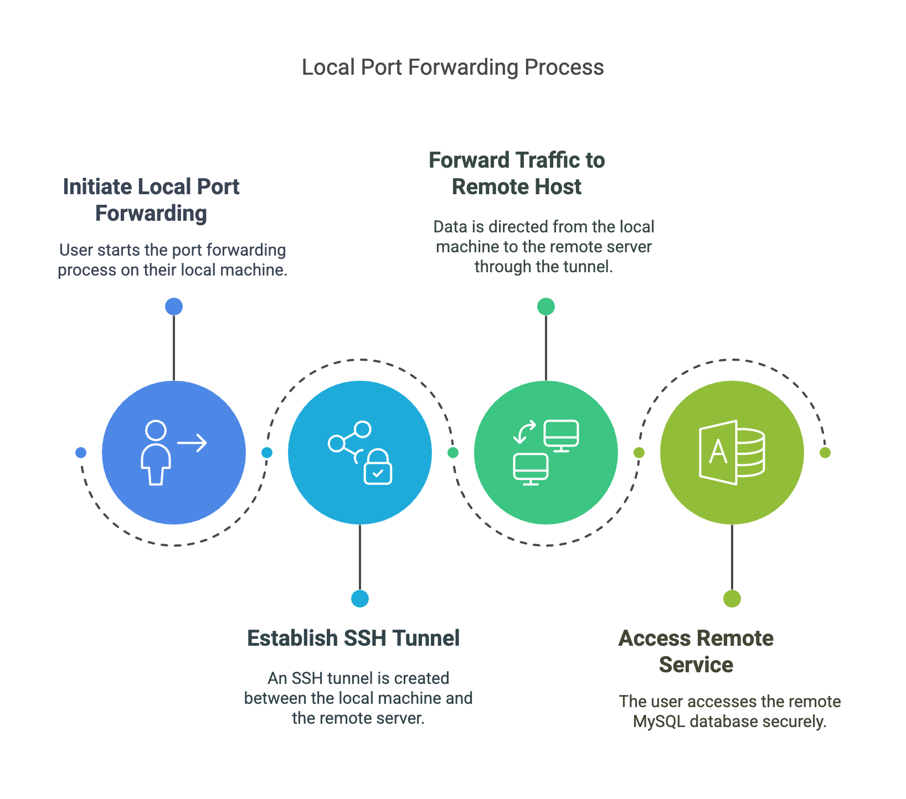
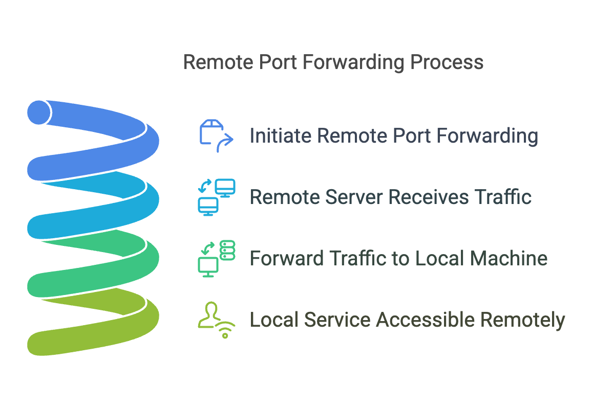
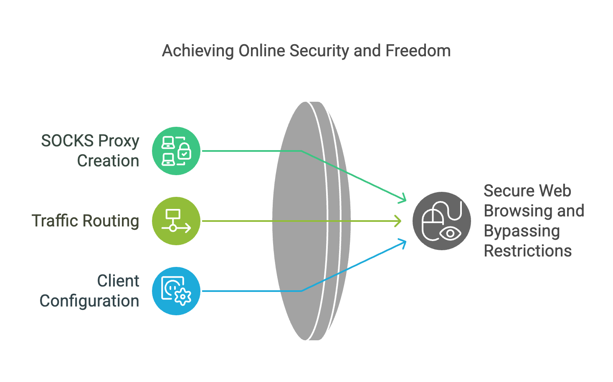

In the world of Linux system administration, SSH (Secure Shell) serves as a cornerstone for securely connecting to remote machines. Beyond just remote access, SSH offers a range of powerful features, one of which is SSH Port Forwarding (also known as SSH Tunneling).

SSH Port Forwarding allows you to securely forward network traffic from one machine to another through an encrypted tunnel. It’s incredibly useful for accessing services behind a firewall, securing communication over untrusted networks, or even bypassing network restrictions. Whether you're working with databases, web servers, or sensitive applications, SSH Tunneling can simplify and secure your workflows.

This article will guide you step-by-step on how to perform different types of SSH Port Forwarding in Linux: Local Port Forwarding, Remote Port Forwarding, and Dynamic Port Forwarding.


##  Types of SSH Port Forwarding

SSH Port Forwarding comes in three distinct types, each serving specific use cases. Understanding their differences is key to leveraging them effectively.

### **A. Local Port Forwarding**



Local Port Forwarding allows you to forward a port on your local machine to a specific port on a remote server. This type of forwarding is typically used to securely access services running on a remote server from your local device.

- **How it works**:
  Your local machine acts as a client and forwards traffic to a remote host via an SSH tunnel.
- **Use case**:
  For example, securely accessing a remote MySQL database server from your local machine.

### **B. Remote Port Forwarding**




Remote Port Forwarding does the opposite of Local Port Forwarding. It forwards a port on the remote server to a specific port on your local machine. This allows a remote user or server to access services running locally on your system.

- **How it works**:
  The remote server acts as the forwarding endpoint, sending traffic back to the specified local machine and port via the SSH tunnel.
- **Use case**:
  For instance, exposing a local development web server to the internet so that remote stakeholders can access it.

### **C. Dynamic Port Forwarding**




Dynamic Port Forwarding creates a SOCKS proxy server on your local machine that dynamically routes traffic to different destinations through the SSH tunnel. This is particularly useful for secure web browsing or bypassing network restrictions.

- **How it works**:
  A single local port is opened as a SOCKS proxy. You can configure client applications (e.g., web browsers) to route their traffic through this proxy.
- **Use case**:
  Bypassing regional content restrictions or securing browsing in public Wi-Fi networks.

Each type of forwarding has its unique advantages, and understanding which to use will depend on your specific scenario. In the next section, we’ll go over what you need to get started with SSH Tunneling.


##  Prerequisites

Before diving into the commands and setup for SSH Port Forwarding, ensure that you meet the following requirements:

1. **SSH Access to the Remote Server**
   - You need to have a working SSH connection to the remote server. This requires:
     - A valid username and password or, preferably, an SSH key pair.
     - SSH enabled and configured on the remote machine.

2. **Ensure OpenSSH is Installed**
   - Most Linux distributions come with OpenSSH pre-installed. Verify by running:
     ```bash
     ssh -V
     ```
     If not installed, you can add it using your package manager (e.g., `sudo apt install openssh-client` on Ubuntu/Debian or `sudo yum install openssh` on CentOS).

3. **Network and Firewall Configuration**
   - Ensure that the local and remote ports you plan to use are not blocked by firewalls or other network restrictions.
   - For **Remote Port Forwarding**, the SSH server should allow remote forwarding. Check the `sshd_config` file on the remote server for the `AllowTcpForwarding` setting and ensure it is enabled.

4. **Basic Knowledge of Ports**
   - Familiarize yourself with which ports the services you are forwarding are running on. For example:
     - MySQL typically runs on port 3306.
     - HTTP servers (e.g., Apache, Nginx) typically run on port 80.
     - HTTPS servers use port 443.

Once you have these prerequisites in place, you're ready to move on to performing the different types of SSH Port Forwarding. Let’s get started!


##  How to Perform SSH Port Forwarding

In this section, you'll learn how to set up the three types of SSH Port Forwarding: Local, Remote, and Dynamic. Commands and examples are included for clarity.


### **A. Local Port Forwarding**
Local Port Forwarding allows you to securely forward a port on your local machine to a service running on a remote machine.

- **Command Syntax**:
  ```bash
  ssh -L [local_port]:[remote_host]:[remote_port] user@remote_server
  ```
  - `[local_port]`: The port on your local machine you want to forward (e.g., 8080).
  - `[remote_host]`: The address of the remote host (usually `127.0.0.1` if the service runs on the remote server itself).
  - `[remote_port]`: The port of the service on the remote host (e.g., 3306 for MySQL).
  - `user@remote_server`: The SSH user and the remote server’s address.

- **Example**:
  Forward port 3306 from a remote MySQL server to your local machine:
  ```bash
  ssh -L 3306:127.0.0.1:3306 user@remote-server
  ```
  After running the command, you can access the remote MySQL service locally using:
  ```bash
  mysql -h 127.0.0.1 -P 3306 -u username -p
  ```


### **B. Remote Port Forwarding**
Remote Port Forwarding lets you expose a local service to a remote server.

- **Command Syntax**:
  ```bash
  ssh -R [remote_port]:[local_host]:[local_port] user@remote_server
  ```
  - `[remote_port]`: The port on the remote server you want to forward traffic to (e.g., 8080).
  - `[local_host]`: The address of your local host (usually `127.0.0.1`).
  - `[local_port]`: The port of the service running on your local machine (e.g., 80 for a web server).

- **Example**:
  Expose a web server running on your local machine (port 80) to a remote server on port 8080:
  ```bash
  ssh -R 8080:127.0.0.1:80 user@remote-server
  ```
  Once this is set up, anyone with access to the remote server can visit `http://remote-server:8080` to access your local web server.

- **Important Note**:
  Ensure the SSH server on the remote machine allows remote forwarding. Check for the `GatewayPorts` and `AllowTcpForwarding` options in the server's SSH configuration file (`/etc/ssh/sshd_config`).


### **C. Dynamic Port Forwarding**
Dynamic Port Forwarding sets up a SOCKS proxy on your local machine, routing traffic dynamically to various destinations via the SSH tunnel.

- **Command Syntax**:
  ```bash
  ssh -D [local_port] user@remote_server
  ```
  - `[local_port]`: The port on your local machine to use as the SOCKS proxy (e.g., 1080).

- **Example**:
  Set up a SOCKS proxy on port 1080:
  ```bash
  ssh -D 1080 user@remote-server
  ```
  Configure your applications (e.g., web browsers or other network-enabled tools) to use `127.0.0.1:1080` as the SOCKS [proxy}(. This allows you to securely browse the internet using the remote server as your gateway.

- **Use Case**:
  Dynamic Port Forwarding is especially useful for bypassing content restrictions or securing web browsing over public Wi-Fi.


These steps should help you set up and use SSH Port Forwarding effectively for various scenarios.


## Tips and Best Practices

To make the most of SSH Port Forwarding while keeping your setup secure and efficient, consider the following tips and best practices:

**1. Use SSH Key Authentication**
- Always prefer SSH key pairs over passwords when connecting to remote servers.
- Generate a key pair using:
  ```bash
  ssh-keygen -t rsa -b 4096
  ```
- Copy the public key to the remote server:
  ```bash
  ssh-copy-id user@remote-server
  ```
- This enhances security by eliminating password-based authentication.


 **2. Limit Port Forwarding Scope**
- By default, forwarded ports on your local machine are only accessible from `localhost`. This prevents unauthorized access by external clients.
- If you want to allow access from other devices on your network, specify the binding address, e.g.:
  ```bash
  ssh -L 0.0.0.0:[local_port]:[remote_host]:[remote_port] user@remote-server
  ```
  Be cautious with this configuration and use it only in trusted environments.

 **3. Secure Remote Port Forwarding**
- Ensure that `GatewayPorts` is set to `yes` only when you explicitly want forwarded ports on the remote server to be accessible from external clients.
- Example configuration for `/etc/ssh/sshd_config` on the remote server:
  ```
  AllowTcpForwarding yes
  GatewayPorts yes
  ```
  Reload the SSH daemon after making changes:
  ```bash
  sudo systemctl restart sshd
  ```

 **4. Add Verbose Logging for Troubleshooting**
- Use the `-v` option in your SSH command to enable verbose logging. This helps you debug issues if the connection or forwarding fails:
  ```bash
  ssh -v -L 8080:127.0.0.1:80 user@remote-server
  ```
- For even more detailed logs, use `-vvv` for maximum verbosity.

**5. Avoid Overlapping or Conflicting Ports**
- Ensure that the local or remote ports you are forwarding are not already in use on the respective machines.
- Use the `netstat` or `ss` command to check for port usage:
  ```bash
  netstat -tuln
  ```

**6. Stop Port Forwarding Sessions When Not in Use**
- Once you are done with a session, be sure to close the SSH connection to stop the port forwarding.
- Alternatively, you can configure timeouts in your SSH configuration:
  ```bash
  ClientAliveInterval 300
  ClientAliveCountMax 2
  ```
  This automatically disconnects idle SSH sessions.

**7. Use Strong Firewalls**
- Even with SSH tunneling, it's important to have a properly configured firewall on both local and remote machines.
- Tools like `ufw` (Uncomplicated Firewall) can make this easier:
  ```bash
  sudo ufw enable
  sudo ufw allow ssh
  ```

**8. Test Your Configuration**
- Before using SSH Port Forwarding in a production environment, always test the setup to ensure it behaves as expected.
- Use tools like `curl`, `telnet`, or your application to verify the forwarded ports.

By following these tips, you can ensure a more secure and reliable SSH Port Forwarding setup.


## Conclusion

SSH Port Forwarding, or SSH Tunneling, is a powerful and versatile feature that allows you to securely forward network traffic through an encrypted SSH connection. Whether you’re accessing a remote database with **Local Port Forwarding**, exposing a local service to the internet with **Remote Port Forwarding**, or securing your web traffic with **Dynamic Port Forwarding**, SSH provides the tools you need to enhance security and flexibility in your workflows.

In this article, we’ve covered:
- The three types of SSH Port Forwarding (Local, Remote, and Dynamic).
- The prerequisites and commands to implement each type.
- Tips and best practices to ensure the most secure and efficient configuration.

By mastering SSH Port Forwarding, you can gain more control over network traffic, bypass restrictions, and improve the security of your communication. Start experimenting with these techniques and integrate them into your system administration toolkit to navigate complex networking scenarios with ease.

If you’re new to SSH or tunneling, remember that testing and hands-on practice are your best teachers. With a little time and effort, you’ll become proficient in using SSH tunneling to solve real-world challenges.

Happy tunneling, and stay secure!
